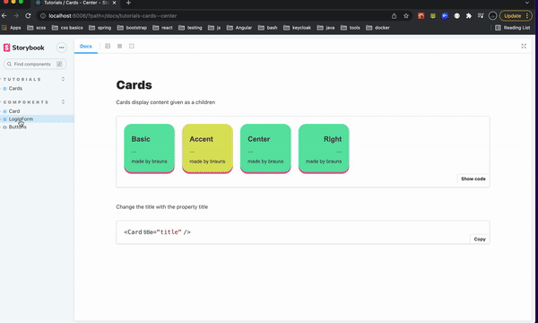

# Examples for Storybook with React

### Install Dependencies
    npm install

### Start Storybook
    npm run storybook

### Run Tests
    npm run test
    npm run test-coverage

### Update Coverage Badge 
    npm run update-badge